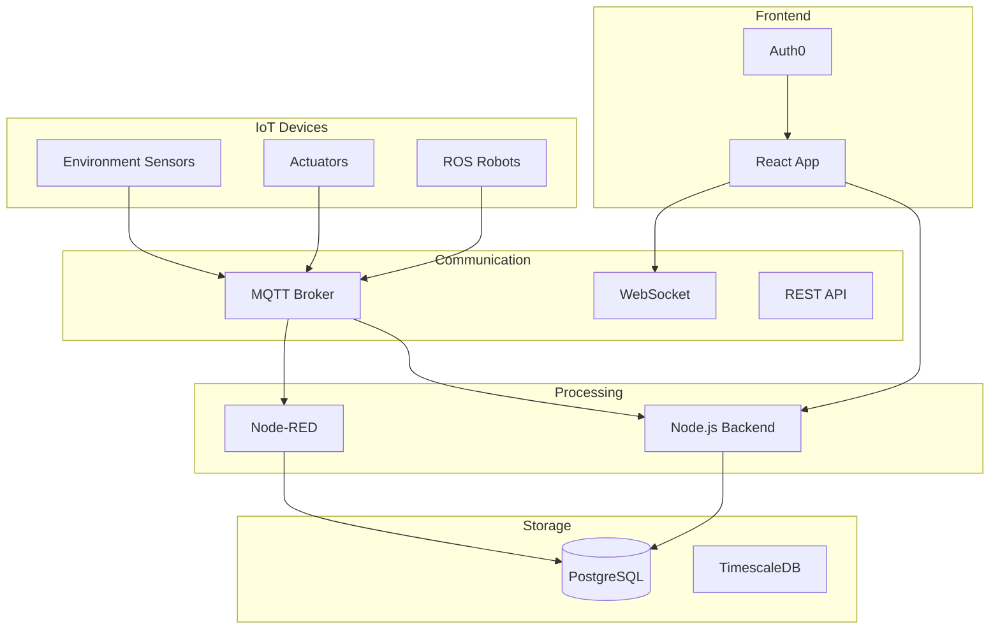

# Smart Building IoT Platform - Project Planning

## 📋 Project Overview

**Vision:** A comprehensive IoT platform for smart building management with ROS robot integration

---

## 🎯 Goals

1. **Smart Building Management** - Monitor and control building systems
2. **IoT Device Integration** - Connect various sensors and actuators
3. **ROS Robot Control** - Integrate and control ROS-based robots
4. **Real-time Monitoring** - Live dashboards and alerts
5. **Automation** - Node-RED flows for automated workflows

---

## 🏗️ Architecture



---

## 📦 Current Services

| Service | URL | Status |
|---------|-----|--------|
| Smart Building App | smart-building-app-production.up.railway.app | ✅ Running |
| Node-RED | railway-nodered-production-1bec.up.railway.app | ✅ Running |
| PostgreSQL | Railway | ✅ Running |

---

## 📝 Features

### Phase 1: Core Platform (Done ✅)
- [x] User authentication (Auth0)
- [x] Device management
- [x] Real-time data display
- [x] PostgreSQL database
- [x] Node-RED integration

### Phase 2: IoT Expansion (In Progress)
- [ ] Add more device types
- [ ] Historical data visualization
- [ ] Alert/notification system
- [ ] Mobile responsive UI

### Phase 3: ROS Integration (Planned)
- [ ] MQTT broker setup
- [ ] ROS robot connectivity
- [ ] Robot control interface
- [ ] Map visualization
- [ ] Navigation controls

### Phase 4: LoRaWAN Integration (Planned)
- [ ] Setup LoRaWAN gateway
- [ ] Deploy ChirpStack network server
- [ ] Register LoRaWAN devices
- [ ] MQTT integration with Node-RED
- [ ] Payload decoding
- [ ] Dashboard for LoRaWAN devices

### Phase 5: Advanced Features (Future)
- [ ] AI/ML analytics
- [ ] Predictive maintenance
- [ ] Energy optimization
- [ ] Multi-building support

---

## 🔧 Tech Stack

| Category | Technology |
|----------|------------|
| Frontend | React + Vite |
| Backend | Node.js + Express |
| Database | PostgreSQL + TimescaleDB |
| Auth | Auth0 |
| Real-time | Socket.io |
| Flow Automation | Node-RED |
| Robot Communication | MQTT / rosbridge |
| Hosting | Railway |
| Version Control | GitHub |

---

## 📊 Data Models

### Device
```
- id: UUID
- name: String
- type: String (temperature, motion, light, humidity, door, hvac, robot)
- location: String
- status: Enum (online, offline, error)
- metadata: JSON
- created_at: Timestamp
- updated_at: Timestamp
```

### Sensor Reading
```
- id: BigInt
- device_id: UUID (FK)
- sensor_type: String
- value: Numeric
- unit: String
- timestamp: Timestamptz
```

### Alert
```
- id: UUID
- device_id: UUID (FK)
- alert_type: String
- message: Text
- severity: Enum (info, warning, error, critical)
- acknowledged: Boolean
- created_at: Timestamptz
```

---

## 🚀 Deployment

### Railway Services
- **smart-building-app** - Main React + Node.js app
- **PostgreSQL** - Database with TimescaleDB
- **Node-RED** - Flow automation
- **MQTT Broker** - IoT device communication (planned)

---

## 📅 Timeline

| Phase | Description | Target |
|-------|-------------|--------|
| Phase 1 | Core Platform | Done |
| Phase 2 | IoT Expansion | Q1 2026 |
| Phase 3 | ROS Integration | Q2 2026 |
| Phase 4 | Advanced Features | Q3 2026 |

---

## 📋 Project Tasks

### Phase 2: IoT Expansion
- [ ] Add historical data visualization
- [ ] Alert/notification system
- [ ] Mobile responsive UI
- [ ] More device types support

### Phase 3: ROS Integration
- [ ] MQTT broker setup
- [ ] ROS robot connectivity
- [ ] Robot control interface
- [ ] Map visualization
- [ ] Navigation controls

### Phase 4: Advanced Features
- [ ] AI/ML analytics
- [ ] Predictive maintenance
- [ ] Energy optimization
- [ ] Multi-building support

---

## 👥 Team

- **Alan Yeung** - Owner/Developer

---

## 🔗 Links

- [GitHub Repo](https://github.com/bibtv/smart-building-app)
- [Node-RED](https://railway-nodered-production-1bec.up.railway.app)
- [App](https://smart-building-app-production.up.railway.app)
- [Auth0 Dashboard](https://manage.auth0.com)
- [Railway Dashboard](https://railway.com)

---

*Last Updated: 2026-02-16*
