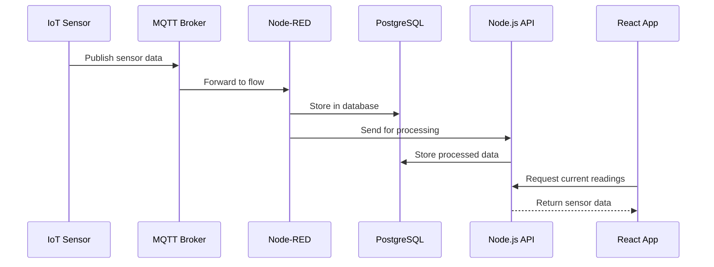
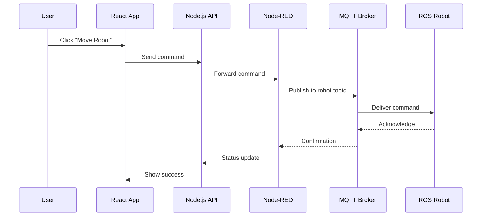
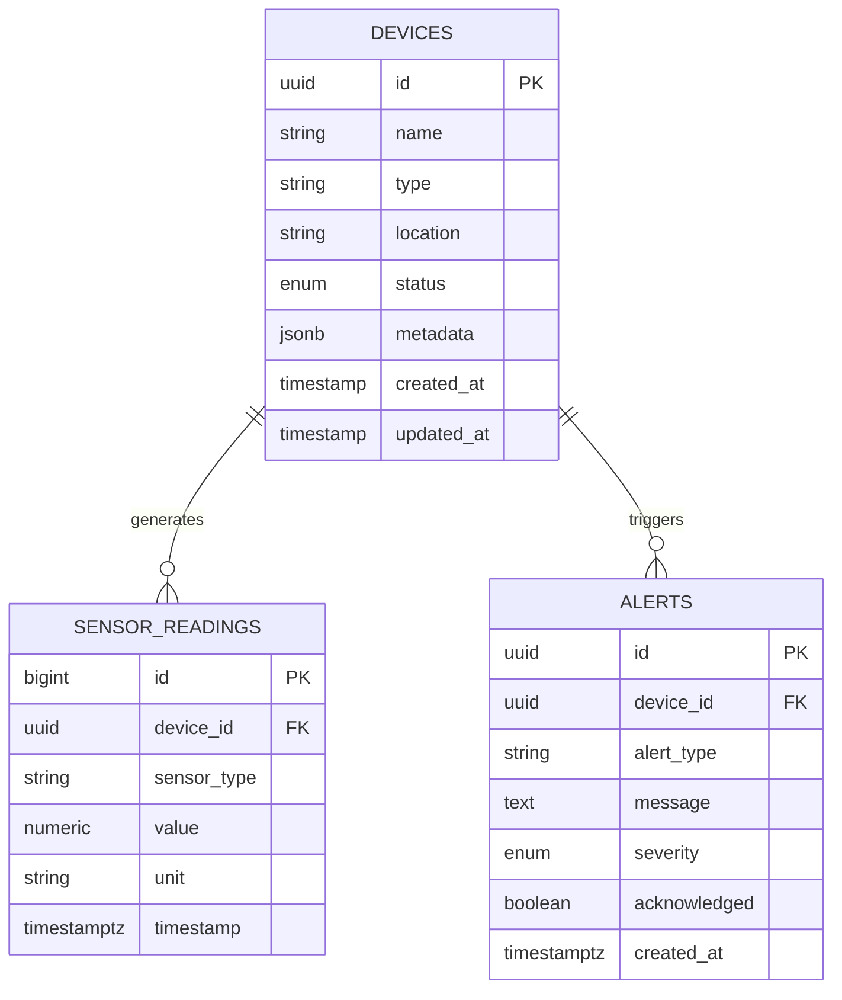
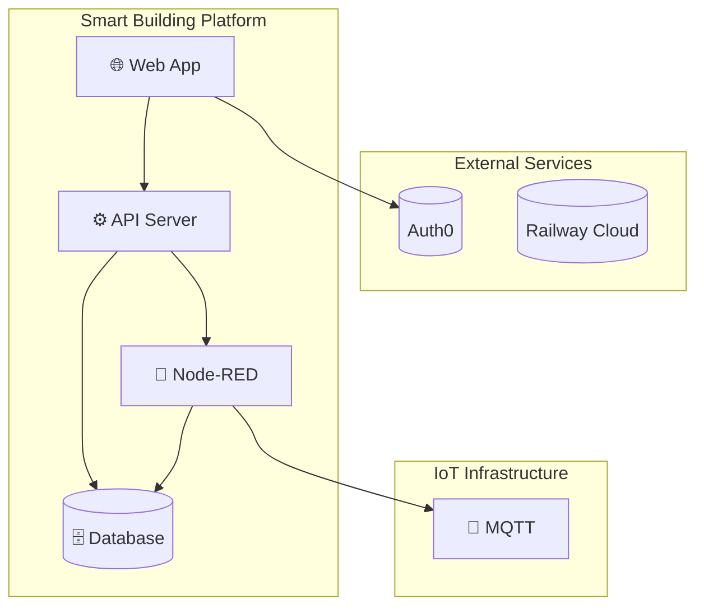
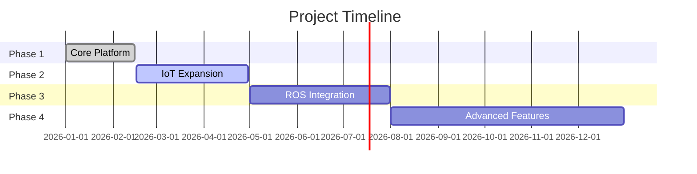

# Smart Building IoT Platform - Architecture Diagrams

## System Architecture

```mermaid
flowchart TB
    subgraph "IoT Layer"
        direction LR
        Sensors["📡 Sensors"]
        Actuators["🎮 Actuators"]
        Robots🤖["🤖 ROS Robots"]
        Cameras["📷 Cameras"]
    end
    
    subgraph "Communication Layer"
        MQTT[("📨 MQTT Broker")]
        WebSocket[(("🔌 WebSocket"))]
        REST[("🌐 REST API")]
    end
    
    subgraph "Processing Layer"
        NodeRED["🎨 Node-RED"]
        Backend["⚙️ Node.js Backend"]
    end
    
    subgraph "Data Layer"
        PostgreSQL[("🗄️ PostgreSQL")]
        TimescaleDB[("📈 TimescaleDB")]
    end
    
    subgraph "Presentation Layer"
        React["⚛️ React App"]
        Auth0[("🔐 Auth0")]
    end
    
    Sensors --> MQTT
    Actuators --> MQTT
    Robots --> MQTT
    Cameras --> MQTT
    
    MQTT --> NodeRED
    MQTT --> Backend
    
    NodeRED --> PostgreSQL
    Backend --> PostgreSQL
    Backend --> TimescaleDB
    
    React --> REST
    React --> WebSocket
    React --> Auth0
```

---

## Data Flow - Device Reading



---

## Data Flow - Robot Control



---

## Database Schema



---

## System Components



---

## Deployment Architecture

```mermaid
flowchart LR
    subgraph "Railway Cloud"
        subgraph "Smart Building App"
            Frontend[⚛️ React]
            Backend[⚙️ Node.js]
        end
        Database[(🗄️ PostgreSQL)]
        NodeRED[🎨 Node-RED]
    end
    
    subgraph "IoT Network"
        MQTT[📨 MQTT Broker]
        Devices[📡 IoT Devices]
        Robots🤖[🤖 ROS Robots]
    end
    
    Frontend --> Backend
    Backend --> Database
    Backend --> NodeRED
    NodeRED --> MQTT
    MQTT --> Devices
    MQTT --> Robots
```

---

## Feature Roadmap


