# 📊 Architecture Diagrams

This file contains Mermaid diagrams for the Smart Building IoT Platform.

---

## System Architecture

```mermaid
flowchart TB
    subgraph "IoT Layer"
        direction LR
        Sensors["📡 Sensors"]
        Actuators["🎮 Actuators"]
        Robots["🤖 ROS Robots"]
        LoRaWAN["📡 LoRaWAN Devices"]
    end
    
    subgraph "Communication"
        MQTT["📨 MQTT"]
        WebSocket["🔌 WebSocket"]
        REST["🌐 REST API"]
    end
    
    subgraph "Network Server"
        ChirpStack["📟 ChirpStack"]
    end
    
    subgraph "Processing"
        NodeRED["🎨 Node-RED"]
        Backend["⚙️ Backend"]
    end
    
    subgraph "Storage"
        DB["🗄️ PostgreSQL"]
    end
    
    subgraph "Frontend"
        React["⚛️ React"]
        Auth["🔐 Auth0"]
    end
    
    Sensors --> MQTT
    Actuators --> MQTT
    Robots --> MQTT
    LoRaWAN --> ChirpStack
    ChirpStack --> MQTT
    MQTT --> NodeRED
    MQTT --> Backend
    NodeRED --> DB
    Backend --> DB
    React --> REST
    React --> WebSocket
    React --> Auth
```

---

## Data Flow - Sensor Reading

---

## Data Flow - Robot Control

---

## Database Schema

---

## Deployment Architecture

---

## Feature Roadmap

---

## MQTT Topic Structure

```mermaid
graph LR
    subgraph "Topics"
        Direction["📍 Direction"]
        Reading["building/{location}/{type}/reading"]
        Status["building/{location}/{type}/status"]
        Command["building/{location}/{type}/command"]
    end
    
    Reading -->|"Subscribe"| NodeRED
    Status -->|"Subscribe"| NodeRED
    NodeRED -->|"Publish"| Command
```

